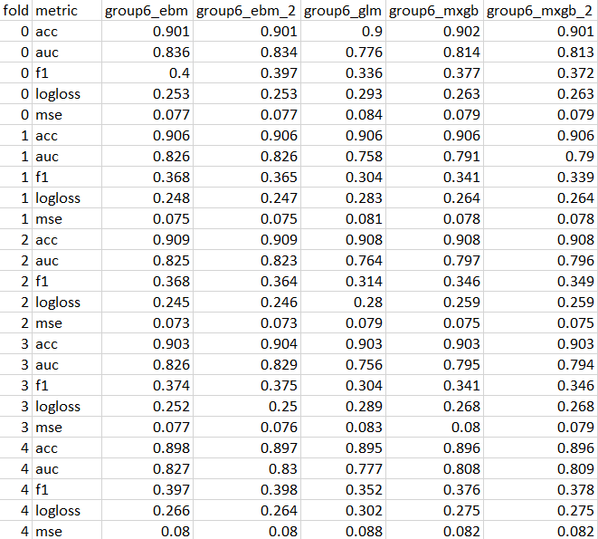

# Group 6 Final Assessment 

### Introduction
* The purpose of this project was to implement an interpretable machine learning (ML) model that takes into consideration real-world problems in ML, such as security, privacy, and discrimination.
* The type of ML model that was used in this project was an explainable boosting machine model (EBM) which is a tree-based, cyclical gradient boosting generalized additive model (GAM) with automatic detection that is just as accurate as a blackbox model while remaining interpretable. 
* The follwing group members that worked on developing the EBM model include Runzhe Tang, Qian Xie, and Matias Roca. 

### Intended Use
* Describe the business value of your group’s best remediated model
* Describe how your group’s best remediated model is designed to be used
* Describe the intended users for your group’s best remediated model
* State whether your group’s best remediated model can or cannot be used for any additional
purposes

# IMAGES EXAMPLE

### Training Data
* State the source of training data
* State how training data was divided into training and validation data
* State the number of rows in training and validation data
* Define the meaning of all training data columns
* Define the meaning of all engineered columns

### Evaluation Data 
* State the source of evaluation (or test) data
* State the number of rows in evaluation (or test) data
* State any differences in columns between training and evaluation (or test) data

### Model Details
* State the columns used as inputs in your group’s best remediated model
* State the columns used as targets in your group’s best remediated model
* State the type of your group’s best remediated model
* State the software used to implement your group’s best remediated model
* State the version of the modeling software for your group’s best remediated model
* State the hyperparameters or other settings of your group’s best remediated model

### Quantitative Analysis
* State the metrics used to evaluate your group’s best remediated model
* State the values of the metrics for training, validation, and evaluation (or test) data – evaluation (or test) metrics come from the most recent class full evaluation results, link under Assignment 1.
* Provide at least one plot or table from each weekly assignment for a total of at least six plots,
that must include the global variable importance and partial dependence of your group’s best
remediated model.
* Address other alternative models considered

### Ethical Considerations
* Describe potential negative impacts of using your group’s best remediated model:
    * Consider math or software problems
    * Consider real-world risks: who, what, when and how?
* Describe potential uncertainties relating to the impacts of using your group’s best remediated
model:
  * Consider math or software problems
  * Consider real-world risks: who, what, when and how?
* Describe any unexpected or results encountered during training
