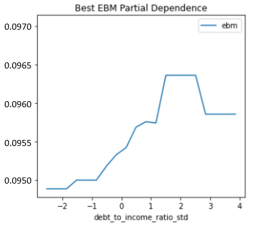

# Group 6 Final Assessment 

### 1.) Introduction
* The purpose of this project was to implement an interpretable machine learning (ML) model that takes into consideration real-world problems in ML, such as security, privacy, and discrimination.
* The type of ML model that was used in this project was an explainable boosting machine model (EBM) which is a tree-based, cyclical gradient boosting generalized additive model (GAM) with automatic detection that is just as accurate as a blackbox model while remaining interpretable. 
* The follwing group members that worked on developing the EBM model include Runzhe Tang, Qian Xie, and Matias Roca. 

### 2.) Intended Use
* The EBM model in this project is beneficial because it can predict the annual percentage rate (APR) charged for a mortgage while taking into consideration fairness, security and accuracy using mortgage, debt, and income information from the Home Mortgage Disclosure Act (HDMA) data. 
* The EBM model was designed to address: 
   * Discrimination by testing and remediating using adverse impact ratio (AIR)
   * Security by conducting a white-hat model extraction attack and identifying vulnerabilities 
   * Accuracy by conducting residual analysis and remediating discovered bugs 
* The intended users for this model are for people intersted in learning how to implement an EBM model. 
* Although the model's intended purpose is to accurately predict APR charged for a mortgage, it can also serve as a template for other users to better understand how to implement an EBM model that takes discrimination, security, and privacy into consideration. 

### 3.) Training Data
* The Home Mortgage Disclosure Act (HDMA) training data was downloaded from this Github repository: https://github.com/jphall663/GWU_rml/tree/master/assignments/data.
* Data was split into train and validation partitions using a 0.7 split ratio or 70% train and 30% test split. 
* Training data has a total of 112,253 rows and 23 columns while the validation data has a total of 48,085 rows and 23 columns. 
* Table # below explains the meaning of all the training data columns: 

##### Table #: Training Data Columns 
Variable  | Meaning
------------- | -------------
high_priced  | Binary target, whether (1) or not (0) the annual percentage rate (APR) charged for a mortgage is 150 basis points (1.5%) or more above a survey-based estimate of similar mortgages. 
conforming  | Binary numeric input, whether the mortgage conforms to normal standards (1), or whether the loan is different (0), e.g., jumbo, HELOC, reverse mortgage, etc.
debt_to_income_ratio_std  | Numeric input, standardized debt-to-income ratio for mortgage applicants.
debt_to_income_ratio_missing  | Binary numeric input, missing marker (1) for debt to income ratio std.
income_std  | Numeric input, standardized income for mortgage applicants.
loan_amount_std  | Numeric input, standardized amount of the mortgage for applicants.
intro_rate_period_std  | Numeric input, standardized introductory rate period for mortgage applicants.
loan_to_value_ratio_std  | Numeric input, ratio of the mortgage size to the value of the property for mortgage applicants.
no_intro_rate_period_std  | Binary numeric input, whether or not a mortgage does not include an introductory rate period.
property_value_std  | Numeric input, value of the mortgaged property.
term_360  |  Binary numeric input, whether the mortgage is a standard 360 month mortgage (1) or a different type of mortgage (0).
black | Binary numeric input, whether a person identifies as black (1) or not black (0). 
asian | Binary numeric input, whether a person identifies as asian (1) or not asian (0). 
white | Binary numeric input, whether a person identifies as white (1) or not white (0). 
amind | Binary numeric input, whether a person identifies as amind (1) or not amind (0). 
hipac | Binary numeric input, whether a person identifies as hipac (1) or not hipac (0). 
hispanic | Binary numeric input, whether a person identifies as hispanic (1) or not hispanic (0). 
non_hispanic | Binary numeric input, whether a person identifies as non_hispanic (1) or not non_hispanic (0). 
male | Binary numeric input, whether a person identifies as male (1) or not male (0). 
female | Binary numeric input, whether a person identifies as female (1) or not female (0). 
agegte62 | Binary numeric input, whether a person is over the age of 62 (1) or not over the age of 62 (0). 
agelt62 | Binary numeric input, whether a person is below the age of 62 (1) or not below the age of 62 (0). 
row_id | Identification number for each row. 

### 4.) Evaluation Data 
* The Home Mortgage Disclosure Act (HDMA) evaluation (or test) data was downloaded from this Github repository: https://github.com/jphall663/GWU_rml/tree/master/assignments/data.
* Evaluation (or test) data has 19,831 rows and 22 columns. 
* The only difference between the columns in the training and evaluation data is that the evaluation data does not have the 'high_priced' column. 

### 5.) Model Details
* Columns used as inputs in the remediated EBM model include: 'property_value_std', 'no_intro_rate_period_std', 'loan_amount_std', 'income_std', 'conforming', 'intro_rate_period_std', 'debt_to_income_ratio_std', and 'term_360'. 
* Column used as a target in the remediated EBM model is 'high_priced'. 
* The EBM model is a type of GAM which treats each input feature in additive fashion resulting in a high level of interpretability. 
* Software/packages used to implement the remediated EBM model include: 'interpret.glassbox', 'interpret.perf', 'numpy', 'pandas', 'time', 'matplotlib.pyplot', and 'matplotlib.lines'.
* Version of the software/packages: 'interpret 0.2.4', 'numpy 1.18.5', and 'pandas 1.0.5'. 
* Hyperparameters for the remediated EBM model include: 'max_bins': 512, 'max_interaction_bins': 16, 'interactions': 10, 'outer_bags': 4, 'inner_bags': 0, 'learning_rate': 0.001, 'validation_size': 0.25, 'min_samples_leaf': 5, 'max_leaves': 5, 'early_stopping_rounds': 100.0, 'n_jobs': NTHREAD, 'random_state': SEED. 

### 6.) Quantitative Analysis
* EBM is the best model when compared to alternative models, like the penalized general linear model (GLM) and monotonic gradient boosting machine (MGBM) model, because it is ranked highest on average across metrics and folds. 
* Table # below shows the metrics used to evaluate EBM against alternative models

##### Table #: Evaluation Metrics Across All Models 

#### 6a.) Global Variable Importance

#### 6b.) Partial Dependence for Top 3 Most Important Variables 

* Provide at least one plot or table from each weekly assignment for a total of at least six plots,
that must include the global variable importance and partial dependence of your group’s best
remediated model.

### 7.) Ethical Considerations
* Describe potential negative impacts of using your group’s best remediated model:
    * Consider math or software problems
    * Consider real-world risks: who, what, when and how?
* Describe potential uncertainties relating to the impacts of using your group’s best remediated
model:
  * Consider math or software problems
  * Consider real-world risks: who, what, when and how?
* Describe any unexpected or results encountered during training
